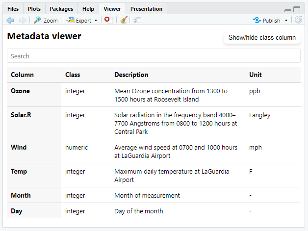

<!-- README.md is generated from README.Rmd. Please edit that file -->

```{r, include = FALSE}
knitr::opts_chunk$set(
  collapse = TRUE,
  comment = "#>",
  fig.path = "man/figures/README-",
  fig.width = 6, 
  fig.height = 6 * 0.618,  # Golden rectangles!
  fig.align = "center", 
  out.width = "80%"
)
```

# gecko.utils 📊🦎 

**A utility package for streamlined figure saving and metadata management in R, especially for LaTeX and project-based workflows.**

[](LICENSE) [](https://cran.r-project.org/)

## Overview

`gecko.utils` provides utility functions that simplify the process of saving figures (specifically `ggplot2` plots) while including essential metadata in file names and captions.
This is particularly useful for LaTeX workflows, archiving older plot versions, and maintaining consistency across projects.
Whether you are working on a manuscript, report, or project that heavily relies on figures, `gecko.utils` helps you automate figure saving with script names, dates, and archival features, so you can focus on your analysis instead of managing files.

## Features

-   `theme_gecko()`: A custom `ggplot2` theme with a clean, minimalistic design.
-   `figure_info()`: Adds metadata (such as the R script name, creation date, and R version) directly to plot captions.
-   `save_plot_with_metadata()`: Saves `ggplot2` and base R figures with structured file names, including the script name and creation date. There is an option to automatically archive older versions of figures and save the latest version in a subfolder, so that figures can be easily referenced from the latest file (without cluttering file names with dates).
-   `show_meta_data()`: Displays metadata for a given data frame, including column descriptions, units, and other relevant attributes. Before you have to use `meta_data()` to assign metadata to a data frame. 

## Installation

### Install the development version from GitHub:

```{install package, include=TRUE}
# Install devtools if not already installed
install.packages("devtools")

# Install gecko.utils from GitHub
devtools::install_github("oli208/gecko.utils")
```

------------------------------------------------------------------------

## Usage

### 1. Saving Figures with Metadata:

The function `save_plot_with_metadata()` allows you to save a figure with a custom file name that includes the script name and creation date.
This improves traceability and ensures you can quickly identify figures based on their origin.

```{r create example plot}
library(gecko.utils)
library(ggplot2)

# Example plot
p <- ggplot(iris, aes(x = Sepal.Length, y = Sepal.Width, colour = Species)) +
  geom_point() +
  labs(
    title = "Sepal dimensions of iris flowers",
    x = "Sepal Length (cm)",
    y = "Sepal Width (cm)",
    colour = "Species"
  ) 
```

```{Save plot, eval=FALSE, include=TRUE}
# Save plot using save_plot_with_metadata
save_plot_with_metadata(plot_name = "scatterplot", save_dir = "images", width = 10, height = 7)
```

There are several arguments you can use with `save_plot_with_metadata()` to customize the file name.
With the example above, the saved figure will be named `scriptname_scatterplot_210920.png` and saved in the `images/` directory.
The aim is to make it easier to identify the script that generated the figure and when it was created.

The `persist_latest` argument is particularly useful when you want to save the latest version of a figure, want to keep different version of a plot and you use LaTex or other tools that require a specific file name.
In this case, the function saves the newest figure without a date in the filename, moving older versions to an archive folder.

```{r Save plot preserve_latest, eval=FALSE, message=FALSE, include=FALSE}
# Save plot using save_plot_with_metadata
save_plot_with_metadata(plot_name = "scatterplot", save_dir = "images", preserve_latest = T, width = 10, height = 7)
```

The file structure will look like this:

```         
/graphics/
  ├── latest/
  │   └── myscript_plot1.png
  │   └── myscript_plot2.png
  │   └── myscript_plot3.png
  ├── archive/
  │   └── myscript_plot1_240828.png
  │   └── myscript_plot1_240914.png
  │   └── myscript_plot1_240916.png
  │   └── myscript_plot2_241028.png
```

Older versions of the plot are moved to the `archive/` folder, while the most recent version is saved in `latest/` and can be referenced in your document without the date in the filename.
The filenames itself help you to identify the script that generated the figure.

### 2. Customizing `ggplot2` Figures with `theme_gecko()`

This package also includes a custom `ggplot2` theme called `theme_gecko()`.
This theme improves the typography and styling of your plots.
The main goal is to make your plots more clear without distracting elements.
You can use it with any `ggplot2` plot by adding `+ theme_gecko()` to your plot code.

```{r theme_gecko, eval=FALSE, include=TRUE}
# Apply the gecko theme to the plot
p + 
  theme_gecko()
```

### 3. Add Figure Metadata with `figure_info()`

Enhance `ggplot` figures by embedding important metadata like script name, creation date, and R version directly into the plot caption.
The caption will be displayed at the bottom of the plot and will include the script name, creation date, and R version used to generate the plot.

```{r figure_info, eval=FALSE, include=TRUE}
# Add figure info (script name, date, R version) to the plot caption
p + 
  figure_info()
```

```{r figure_info_theme_gecko, echo=FALSE}
# showcase figure info with theme_gecko
p + 
  theme_gecko() + 
  figure_info()
```

### 4. Set the Figure Save Path for the Current Project

The gecko.utils package has the possibility to get the figure save path for the current project.
This is useful when you are working with R-Projects and want to save the figures in a specific folder.
After running the function `set_figure_save_path()` the path to the specified folder in the current project is saved in the project in the `.Rprofile`.
This path can be used in the `save_plot_with_metadata()` function to save the figures in the specified folder, without the need to specify the path to the folder every time.

```{r get_project_path, eval=FALSE, message=FALSE, warning=FALSE, include=TRUE}
set_figure_save_path()
```

## Metadata viewer
The Metadata Viewer provides an approach to managing metadata in data frames. It allows users to dynamically display metadata such as descriptions, units and additional information. Metadata is stored directly as attributes of each column, ensuring accessibility and avoiding clutter with multiple data frames.

### Add Metadata to Dataframe
To start, we need to create a metadata dataframe containing information about each column in the `airquality` dataset.

### Create Metadata DataFrame

Before assigning metadata to a dataset, it is necessary to create or load a metadata table.
This metadata should contain relevant annotations such as descriptions and units for each variable.
The following example demonstrates how to create a metadata table for the built-in airquality dataset.

```{r load-airquality-data}
# Load the airquality dataset
data(airquality)

head(airquality)
```

```{r create-metadata}
# Create metadata dataframe
metadata_airquality <- data.frame(
  Datafield = names(airquality),
  Description = c(
    "Mean Ozone concentration from 1300 to 1500 hours at Roosevelt Island",
    "Solar radiation in the frequency band 4000–7700 Angstroms from 0800 to 1200 hours at Central Park",
    "Average wind speed at 0700 and 1000 hours at LaGuardia Airport",
    "Maximum daily temperature at LaGuardia Airport",
    "Month of measurement",
    "Day of the month"
  ),
  Unit = c("ppb", "Langley", "mph", "F", "-", "-")
)
```

The metadata table consists of three columns:

-   **Datafield:** The variable name in the dataset.
-   **Description:** A textual description of what the variable represents.
-   **Unit:** The measurement unit associated with the variable (if applicable).

```{r echo=FALSE}

# Display the metadata dataframe

knitr::kable(metadata_airquality)
```


### Assign Metadata to the Data Frame

To link the metadata to the airquality dataset, the metadata table is assigned using the `meta_data()` function.
This function stores metadata attributes directly within the data frame columns.

```{r add-metadata}
# combinde the metadata with the data frame
meta_data(airquality) <- metadata_airquality
```

### Add Metadata for New Column

In progress

### Show Metadata of Dataframe

The metadata can be displayed in the console or in the Viewer tab of RStudio.

```{r show-metadata-console}
# Show metadata in the console
show_meta_data(airquality)
```

For better readability, metadata can also be displayed in RStudio's Viewer tab as an interactive table.
To display the metadata in the Viewer tab in RStudio, use the `show_in_viewer` argument.

```{r show-metadata-viewer, eval=FALSE}
# Show metadata in the Viewer tab
show_meta_data(airquality, show_in_viewer = TRUE)
```




You can also filter the displayed metadata to only show specific fields, such as `Description`.

```{r show-selected-fields, eval=FALSE}
# Show only Description in the Viewer tab
show_meta_data(airquality, fields = c("Description"), show_in_viewer = TRUE)
```

------------------------------------------------------------------------

## Contributing

Contributions are welcome!
If you would like to contribute:

1.  Fork the repository.
2.  Create a new branch (`git checkout -b feature-branch`).
3.  Make your changes.
4.  Push your branch (`git push origin feature-branch`).
5.  Create a pull request.

## Feedback

If you encounter any bugs or have suggestions for new features, please feel free to open an issue on the [GitHub issues page](https://github.com/oli208/gecko.utils/issues).

------------------------------------------------------------------------

Happy plotting with **`gecko.utils`**!
🦎

------------------------------------------------------------------------
