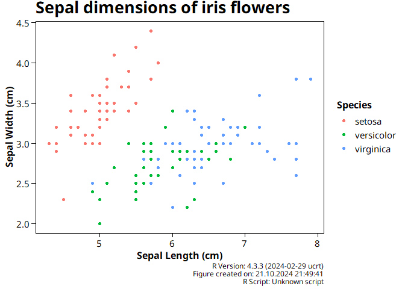

<!-- README.md is generated from README.Rmd. Please edit that file -->

# gecko.utils 📊🦎

**A utility package for streamlined figure saving and metadata
management in R, especially for LaTeX and project-based workflows.**

[](LICENSE)
[](https://cran.r-project.org/)

## Overview

`gecko.utils` provides utility functions that simplify the process of
saving figures (specifically `ggplot2` plots) while including essential
metadata in file names and captions. This is particularly useful for
LaTeX workflows, archiving older plot versions, and maintaining
consistency across projects. Whether you are working on a manuscript,
report, or project that heavily relies on figures, `gecko.utils` helps
you automate figure saving with script names, dates, and archival
features, so you can focus on your analysis instead of managing files.

## Features

- `theme_gecko()`: A custom `ggplot2` theme with improved typography and
  styling.
- `figure_info()`: Add metadata such as the R script name, creation
  date, and R version directly to your plot captions for improved
  traceability.
- `ggsave_custom()`: Save `ggplot` figures with file names that include
  the script name and the date of creation.
- `ggsave_latex()`: Automatically archive older versions of figures and
  save the latest version in a `latex` subfolder, ensuring that figures
  remain easy to access for LaTeX users (without cluttering file names
  with dates).

## Installation

### Install the development version from GitHub:

``` install
# Install devtools if not already installed
install.packages("devtools")

# Install gecko.utils from GitHub
devtools::install_github("oli208/gecko.utils")
```

------------------------------------------------------------------------

## Usage

### 1. Saving Figures with Metadata:

The function `ggsave_custom()` allows you to save a figure with a custom
file name that includes the script name and creation date. This improves
traceability and ensures you can quickly identify figures based on their
origin.

``` r
library(gecko.utils)
library(ggplot2)

# Example plot
p <- ggplot(iris, aes(x = Sepal.Length, y = Sepal.Width, colour = Species)) +
  geom_point() +
  labs(
    title = "Sepal dimensions of iris flowers",
    x = "Sepal Length (cm)",
    y = "Sepal Width (cm)",
    colour = "Species"
  ) 
```

``` save
# Save plot using ggsave_custom
ggsave_custom("scatterplot", filepath = "images", width = 10, height = 7)
```

### 2. LaTeX Integration with `ggsave_latex()`:

The `ggsave_latex()` function is specifically designed for users working
with LaTeX. It saves the newest figure without a date in the filename,
moving older versions to an archive folder.

When using this function, your directory should be organized as follows:

    /graphics/
      ├── latex/
      │   └── my_script_plot1.png
      ├── archive/
      │   └── my_script_plot1_240101.png

Older versions of the plot are moved to the `archive/` folder, while the
most recent version is saved in `latex/`.

### 3. Add Figure Metadata with `figure_info()` and `theme_gecko()`

Enhance `ggplot` figures by embedding important metadata like script
name, creation date, and R version directly into the plot caption.

``` r
# Add figure info (script name, date, R version) to the plot caption
p + 
  figure_info() +
  theme_gecko() 
#> Registering fonts with R
```



------------------------------------------------------------------------

## Contributing

Contributions are welcome! If you would like to contribute:

1.  Fork the repository.
2.  Create a new branch (`git checkout -b feature-branch`).
3.  Make your changes.
4.  Push your branch (`git push origin feature-branch`).
5.  Create a pull request.

## Feedback

If you encounter any bugs or have suggestions for new features, please
feel free to open an issue on the [GitHub issues
page](https://github.com/oli208/gecko.utils/issues).

------------------------------------------------------------------------

Happy plotting and automating your workflows with **`gecko.utils`**! 🦎

------------------------------------------------------------------------
